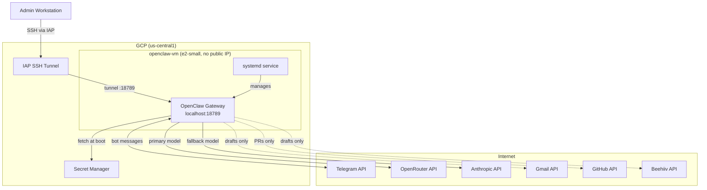

# Architecture Diagram

```mermaid
graph TB
    subgraph Internet
        TG[Telegram API]
        OR[OpenRouter API]
        AN[Anthropic API]
        GM[Gmail API]
        GH[GitHub API]
        BH[Beehiiv API]
    end

    subgraph GCP["GCP (us-central1)"]
        subgraph VM["openclaw-vm (e2-small, no public IP)"]
            GW[OpenClaw Gateway<br/>localhost:18789]
            SYS[systemd service]
        end
        SM[Secret Manager]
        IAP[IAP SSH Tunnel]
    end

    Admin[Admin Workstation] -->|SSH via IAP| IAP
    IAP -->|tunnel :18789| GW

    SYS -->|manages| GW
    GW -->|fetch at boot| SM

    GW <-->|bot messages| TG
    GW -->|primary model| OR
    GW -->|fallback model| AN
    GW -.->|drafts only| GM
    GW -.->|PRs only| GH
    GW -.->|drafts only| BH
```
