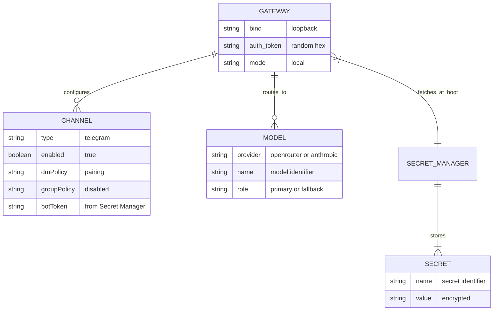

# Entity Relationship Diagram

This project has no custom data models or databases. OpenClaw manages its own internal state. The key configuration entities are:

```mermaid
erDiagram
    GATEWAY ||--o{ CHANNEL : configures
    GATEWAY ||--o{ MODEL : routes_to
    GATEWAY {
        string bind "loopback"
        string auth_token "random hex"
        string mode "local"
    }
    CHANNEL {
        string type "telegram"
        boolean enabled "true"
        string dmPolicy "pairing"
        string groupPolicy "disabled"
        string botToken "from Secret Manager"
    }
    MODEL {
        string provider "openrouter or anthropic"
        string name "model identifier"
        string role "primary or fallback"
    }
    SECRET_MANAGER ||--|{ SECRET : stores
    SECRET {
        string name "secret identifier"
        string value "encrypted"
    }
    GATEWAY }|--|| SECRET_MANAGER : fetches_at_boot
```
