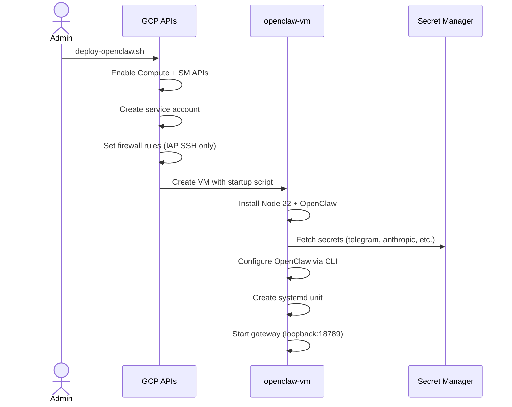
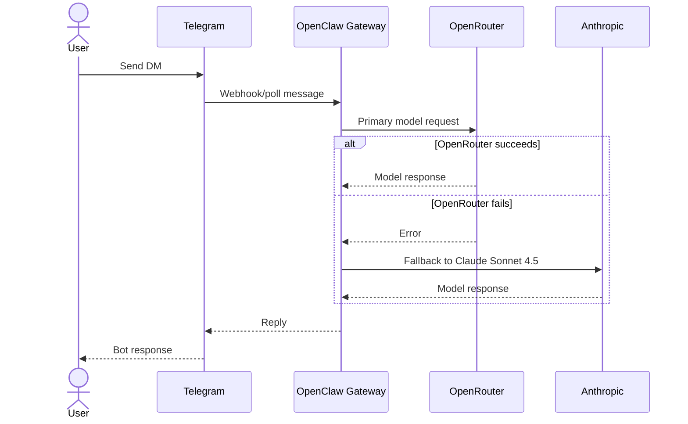

# Sequence Diagrams

## VM Deployment

```mermaid
sequenceDiagram
    actor Admin
    participant GCP as GCP APIs
    participant VM as openclaw-vm
    participant SM as Secret Manager

    Admin->>GCP: deploy-openclaw.sh
    GCP->>GCP: Enable Compute + SM APIs
    GCP->>GCP: Create service account
    GCP->>GCP: Set firewall rules (IAP SSH only)
    GCP->>VM: Create VM with startup script
    VM->>VM: Install Node 22 + OpenClaw
    VM->>SM: Fetch secrets (telegram, anthropic, etc.)
    VM->>VM: Configure OpenClaw via CLI
    VM->>VM: Create systemd unit
    VM->>VM: Start gateway (loopback:18789)
```

## Telegram Message Flow

```mermaid
sequenceDiagram
    actor User
    participant TG as Telegram
    participant GW as OpenClaw Gateway
    participant OR as OpenRouter
    participant AN as Anthropic

    User->>TG: Send DM
    TG->>GW: Webhook/poll message
    GW->>OR: Primary model request
    alt OpenRouter succeeds
        OR-->>GW: Model response
    else OpenRouter fails
        OR-->>GW: Error
        GW->>AN: Fallback to Claude Sonnet 4.5
        AN-->>GW: Model response
    end
    GW-->>TG: Reply
    TG-->>User: Bot response
```
